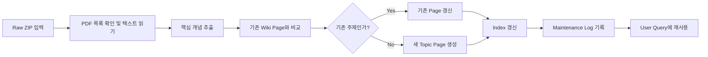

# Raw Source to Wiki Pages Pipeline

## 목적

첨부된 Agentic Coding Basics 자료를 raw source로 전달했을 때 LLM agent가 wiki pages를 구성하고 유지보수하는 절차입니다.

## 입력

`raw/Agentic_Coding_Basics.zip`

압축파일 안에는 Agentic Coding Basics 강의 PDF들이 들어 있습니다.

## 파이프라인

## 단계별 설명

1. raw ZIP 안의 PDF 목록을 확인합니다.
2. 각 PDF에서 핵심 개념을 추출합니다.
3. `wiki/index.md`를 읽고 기존 page와 비교합니다.
4. 같은 주제가 있으면 기존 page를 갱신합니다.
5. 새로운 주제라면 `SCHEME.md` 형식으로 page를 생성합니다.
6. `wiki/index.md`에 page 링크를 추가합니다.
7. `wiki/maintenance-log.md`에 변경 내용을 기록합니다.
