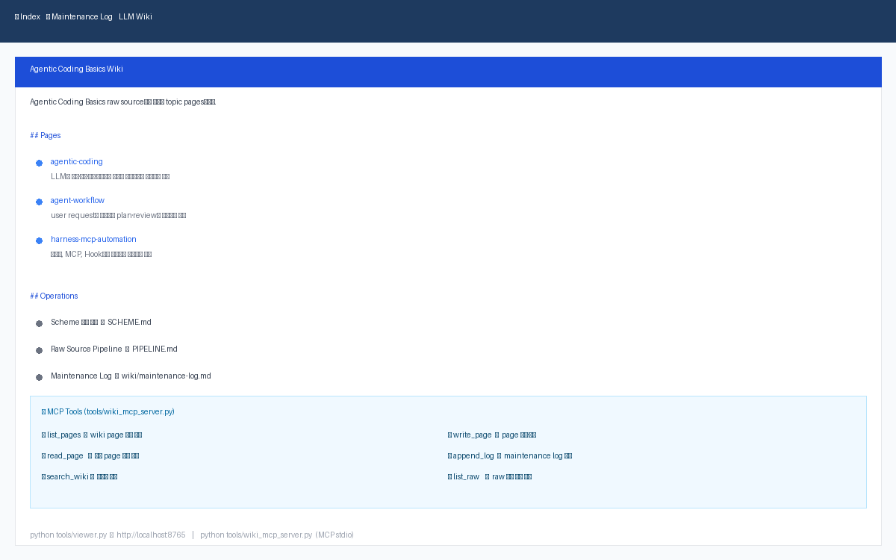

# LLM Wiki

LLM을 일회성 답변 생성기가 아니라 **지식베이스 유지보수자**로 활용하는 Markdown-only 위키입니다.
raw source(ZIP, PDF, MD 등)를 넣으면 에이전트가 wiki page를 자동으로 생성·갱신합니다.



---

## 30분 빠른 시작 — 내 자료로 첫 wiki page 만들기

### 0. 요구사항

| 항목 | 버전 |
|---|---|
| Python | 3.9 이상 |
| Claude Desktop 또는 Claude Code CLI | 최신 |
| OS | macOS / Linux / Windows (WSL 권장) |

Python 외 별도 패키지 설치는 필요하지 않습니다.

---

### 1단계 — 저장소 클론

```bash
git clone https://github.com/<your-username>/llm-wiki.git
cd llm-wiki
```

---

### 2단계 — 뷰어 실행 (선택, 미리 확인용)

```bash
python tools/viewer.py
```

브라우저에서 http://localhost:8765 를 열면 현재 wiki를 볼 수 있습니다.

---

### 3단계 — MCP 서버 등록

#### Claude Desktop 사용 시

`~/Library/Application Support/Claude/claude_desktop_config.json` (macOS) 또는
`%APPDATA%\Claude\claude_desktop_config.json` (Windows)을 열고 아래를 추가합니다.

```json
{
  "mcpServers": {
    "llm-wiki": {
      "command": "python3",
      "args": ["/절대경로/llm-wiki/tools/wiki_mcp_server.py"]
    }
  }
}
```

> **주의**: `args` 안의 경로를 저장소의 **절대 경로**로 수정하세요.

저장 후 Claude Desktop을 재시작합니다.

#### Claude Code CLI 사용 시

```bash
# 저장소 루트에서 실행
claude mcp add llm-wiki -- python3 tools/wiki_mcp_server.py
```

---

### 4단계 — 내 자료 넣기

```bash
# 방법 A: ingest.sh 사용 (Claude Code CLI 설치 시)
./ingest.sh /path/to/my_document.pdf

# 방법 B: 수동으로 raw/ 에 복사
cp /path/to/my_document.pdf raw/
```

---

### 5단계 — 에이전트에게 wiki 생성 요청

Claude Desktop 또는 Claude Code에서 다음 메시지를 입력합니다.

```
raw/my_document.pdf 파일이 추가됐습니다.
RULES.md와 PIPELINE.md를 따라 wiki page를 생성하거나 갱신하고,
wiki/index.md와 wiki/maintenance-log.md를 업데이트하세요.
```

에이전트는 MCP 도구(`list_raw`, `write_page`, `append_log` 등)를 사용하여
자동으로 wiki page를 작성합니다.

---

### 6단계 — 결과 확인

```bash
python tools/viewer.py
# http://localhost:8765 에서 새 page 확인
```

---

## 저장소 구조

```
llm-wiki/
├── RULES.md            ← 에이전트 운영 지침 (harness 진입점)
├── AGENTS.md           ← 에이전트 역할·절차 정의
├── SCHEME.md           ← wiki page 형식 명세
├── PIPELINE.md         ← raw → wiki 처리 파이프라인
├── RESEARCH.md         ← LLM Wiki 개념 조사
├── mcp.json            ← MCP 서버 설정 예시
├── ingest.sh           ← 자료 투입 + 에이전트 호출 스크립트
│
├── raw/                ← 원본 자료 보존 (수정 금지)
│   └── Agentic_Coding_Basics.zip
│
├── wiki/
│   ├── index.md        ← 전체 page 탐색
│   ├── maintenance-log.md
│   └── pages/          ← topic pages
│       ├── agentic-coding.md
│       ├── agent-workflow.md
│       └── harness-mcp-automation.md
│
├── tools/
│   ├── wiki_mcp_server.py   ← MCP 서버 (stdio)
│   └── viewer.py            ← 로컬 wiki 뷰어
│
├── hooks/
│   ├── pre_ingest.sh        ← raw 추가 전 검증
│   └── post_update.sh       ← wiki 수정 후 정합성 확인
│
├── skills/
│   ├── ingest_raw.md        ← raw → wiki 생성 skill
│   ├── update_page.md       ← page 갱신 skill
│   └── query_wiki.md        ← wiki 검색·답변 skill
│
├── schema/
│   └── page.schema.json     ← wiki page 메타데이터 스키마
│
└── demo/
    └── wiki_viewer_demo.png ← 실사용 화면 캡처
```

---

## MCP Tool 목록

| Tool | 설명 | 주요 파라미터 |
|---|---|---|
| `list_pages` | wiki/pages/ 의 page 목록 반환 | — |
| `read_page` | 특정 page 내용 반환 | `name`: page slug |
| `read_index` | wiki/index.md 전체 반환 | — |
| `search_wiki` | 키워드로 wiki 검색 | `query`: 검색어 |
| `write_page` | page 생성 또는 갱신 | `name`, `content` |
| `append_log` | maintenance-log에 항목 추가 | `entry`: Markdown 내용 |
| `list_raw` | raw/ 파일 목록 반환 | — |

MCP 서버는 `tools/wiki_mcp_server.py`를 **stdio 모드**로 실행합니다.
별도 포트나 네트워크 설정이 필요하지 않습니다.

---

## 자료 투입 → wiki 생성 흐름

```
내 파일
  └─► ./ingest.sh my_file.pdf
        ├─ hooks/pre_ingest.sh   (중복·형식 검증)
        ├─ raw/ 에 복사
        ├─ claude CLI 에이전트 호출
        │     └─ MCP: list_raw → write_page → append_log
        └─ hooks/post_update.sh  (index 정합성 확인)

결과:
  wiki/pages/<new-topic>.md  생성
  wiki/index.md              갱신
  wiki/maintenance-log.md    기록
```

---

## 검증 방법

```bash
# 1. MCP 서버 단독 테스트 (JSON-RPC over stdin)
echo '{"jsonrpc":"2.0","id":1,"method":"initialize","params":{}}' \
  | python tools/wiki_mcp_server.py

echo '{"jsonrpc":"2.0","id":2,"method":"tools/list","params":{}}' \
  | python tools/wiki_mcp_server.py

echo '{"jsonrpc":"2.0","id":3,"method":"tools/call","params":{"name":"list_pages","arguments":{}}}' \
  | python tools/wiki_mcp_server.py

# 2. 뷰어 동작 확인
python tools/viewer.py &
curl -s http://localhost:8765 | grep -o '<title>[^<]*</title>'

# 3. hook 단독 실행
bash hooks/post_update.sh
```

---

## API Key 관련 주의사항

이 저장소의 어떤 파일에도 API Key를 하드코딩하지 않습니다.
에이전트 호출이 필요한 경우 아래 방법 중 하나를 사용하세요.

- **Claude Desktop**: GUI에서 로그인 — 코드에 Key 불필요
- **Claude Code CLI**: `claude` 명령이 설정된 자격증명을 사용
- **환경변수**: `export ANTHROPIC_API_KEY=sk-...` 후 스크립트 실행

---

## 참고

- Andrej Karpathy, `llm-wiki`: https://gist.github.com/karpathy/442a6bf555914893e9891c11519de94f
- [Model Context Protocol 명세](https://spec.modelcontextprotocol.io)
